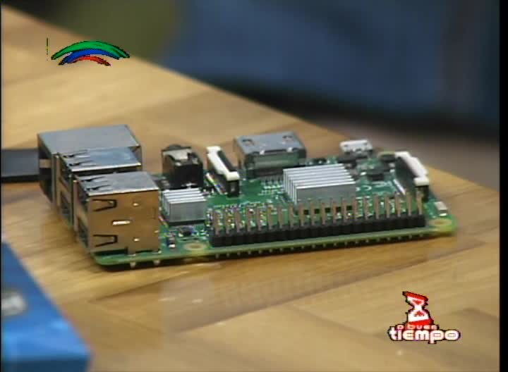

## Experiencias de la Comunidad de Debian GNU/Linux en la Cuba Profunda

###### [Leonel Salazar Videaux](http://debianhlg.cubava.cu/) / [@leonel_lordford](https://twitter.com/leonel_lordford?lang=es)

------

###### Get the slides [source code](https://github.com/leonel-lordford/cubaconf17-experiencias-swl-cuba-profunda) under [Attribution 4.0 International](http://creativecommons.org/licenses/by/4.0/) License.

---

## Acerca del autor

------

- 2004-actualidad: usuario de GNU/Linux (SuSE, Ubuntu, Nova, Debian)
- 2006: miembro de la comunidad SWL de la UCI
- 2007: Ing. en Ciencias Informáticas
- 2009: fundador GUTL
- 2009-10-11-12-13-16: FLISOL (Habana, Bayamo, Manzanillo, Holguín)
- 2015: SysAdmin UHo
- 2016: #CubaConf

---

## ¿Porqué esta presentación?

------

- Reconocer el trabajo de la comunidad de usuarios en el Oriente del país
- Mencionar algunos proyectos desarrollados en Holguín y Manzanillo
- Obtener apoyo para continuar impulsando el SWL en toda Cuba

---

## #CubaConf'16 fue la inspiración

--

--

--

--

--

--

> Gracias al comité organizador por permitirnos vivir esa experiencia inolvidable

------

Más fotos sobre [CubaConf'16](https://goo.gl/photos/s9R1aWHBKSqibHMK7)

---

### GUTL 

------

- Miembros por toda Cuba
- En Oriente
  - miembros activos\*: Holguín (6), Granma (2) y Santiago de Cuba (1)
  - actividades: FLISOL, GUTL-Ote, Día del Documento Libre

\* Cifras ***no oficiales***

---

## Apoyo institucional

------

- Joven Club de Computación y Electrónica
- Club de Software Libre en la UIC-Holguín

---

## Algunos resultados

--

Holguín
- de las comunidades más activas en el país
- 1 miembro oficial de TDF
- 4 desarrolladores activos
- 2 programas en desarrollo
- 2 repositorios activos en GitHub
- 3 blogs con visibilidad internacional ([DebianHlg](http://debianhlg.cubava.cu), [Python Scouts](http://pythonscouts.cubava.cu), [LibreOffice](http://libreoffice.cubava.cu))
- 1 espacio para las Tecnologías Libres en **A Buen Tiempo** (programa de TV TeleCristal)

--

Granma
- mayor cantidad de programas libres desarrollados en el país
- hosting de [RepoGUTL](http://www.grm.jovenclub.cu/repogutl/)
- 1 de los principales defensores del SWL en el país
- 1 de los editores del [portal GUTL](http://gutl.jovenclub.cu)
- 1 desarrollador activo
- varios programas en desarrollo, ver en [RepoGUTL](http://www.grm.jovenclub.cu/repogutl/)

--

Santiago de Cuba

- 1 de los editores del [portal GUTL](http://gutl.jovenclub.cu)
- creador del [Blog SWL-X](http://swlx.260mb.net/)
- 1 desarrollador activo

---

## Actividades realizadas en Holguín

--

Día del Documento Libre

--

--

--

--

FLISOL

--

--

--

--

A Buen Tiempo

--

--

--

--

Actividades de recreación

--

--

--

--

--

---

## Actividades propuestas

--

- Meetups
- FLISOL
- Día del Documento Libre
- Debian Day
- PyDay
- Hackatones / Sprints
- GUTL-Ote
- Quizás alguna de las siguientes:
  - MiniDebConf
  - CubaConf
  - PyCon

---

## Fortalezas de la Cuba Profunda

--
- Voluntad
- Conocimiento
- Infraestructura

--

- Cultura
- Geografía
- Turismo
- Historia

---

## ¿Qué necesitamos?

------

* Divulgación usando todos los medios posibles
* Confianza por parte de las instituciones
* Una red de proyectos colaborativos
* Reconocimiento legal en el país, esto nos daría:
  * credibilidad
  * autonomía
  * acceso a donaciones financieras y materiales

---

## Conclusiones

------

* 8 años de GUTL
* RepoGUTL es una realidad
* Presencia en [CubaConf](https://www.cubaconf.org)

---

## Invitación

------

- Jueves 9 de Noviembre como parte de CubaConf'17 primera [**MiniDebConf**](https://wiki.debian.org/Cuba/Eventos/MiniDebConfCuba2017) oficial en Cuba

